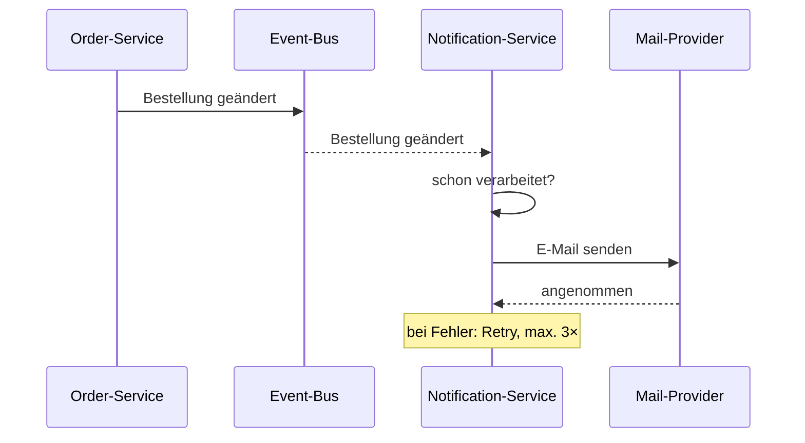

# add-order-notifications · Architekt · Betroffener Teil

## Kurzfassung
Der Change führt Benachrichtigungen bei Statuswechsel einer Bestellung ein.
Ein neuer Notification-Service hört auf Ereignisse des Order-Service und
verschickt E-Mails. Der Order-Service selbst kennt den neuen Service nicht.

## Anforderungen
- Order-Service veröffentlicht bei jedem Statuswechsel ein Ereignis "Bestellung geändert"
- Notification-Service verarbeitet Ereignisse asynchron und idempotent
- Zustellung innerhalb von 60 s nach Statuswechsel
- Fehlgeschlagene Zustellungen werden bis zu 3× wiederholt
- Kein Ereignis darf verloren gehen, auch wenn Notification-Service nicht läuft

## Hauptfall

## Was sich ändert / Was unberührt bleibt
- **Neu:** Notification-Service, Event-Bus-Topic, Tabelle für verarbeitete Ereignisse
- **Geändert:** Order-Service publiziert Ereignisse (bisher keine)
- **Unberührt:** Web-Frontend, Inventory, Zahlungsabwicklung

## Risiken & Tradeoffs
- Neue Infrastruktur (Event-Bus) nur für einen Consumer – Overhead vs. Entkopplung
- Idempotenz braucht eigenen Speicher im Notification-Service
- Mail-Provider ist externe Abhängigkeit ohne SLA in der Spec

## ⚠ Annahmen
- ⚠ Annahme: Event-Bus ist bereits vorhanden. Spec nennt keinen konkreten.
- ⚠ Annahme: "Statuswechsel" umfasst auch Stornierung.

## Approval-Fragen
1. Asynchron über Event-Bus statt direktem Aufruf – einverstanden?
2. Retry 3× reicht, danach Ereignis verwerfen – oder Dead-Letter nötig?
3. Stornierung als Statuswechsel behandeln – ja?
4. Ist ein Event-Bus für einen einzigen Consumer gerechtfertigt?
