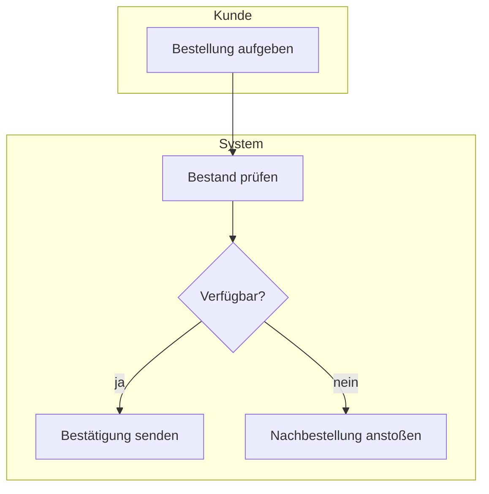
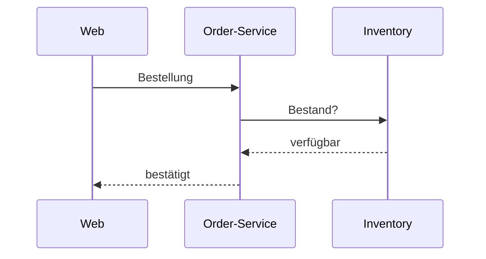

# Diagramme mit Mermaid

Warum Mermaid: Textbasiert, rendert nativ in GitHub, VS Code, Claude Code,
Obsidian und Claude.ai. Kein Java, kein Server, kein Bild-Export nötig.
Deckt UML (Klassen, Sequenz, Zustand), Architektur (C4, Flowchart), Daten
(ER) und Abläufe (Flowchart mit Swimlanes) ab. Echtes BPMN gibt es nicht –
wird über Flowchart mit Subgraphs pro Rolle angenähert, was für ein Review
reicht. Falls später echtes BPMN nötig ist: bpmn-js oder PlantUML ergänzen.

## Typ-Zuordnung

| Bedarf | Mermaid-Typ |
|---|---|
| Prozesslandkarte, Komponentenübersicht, Schichten | `flowchart LR` mit `subgraph` |
| Ablauf mit Rollen (BPMN-Näherung) | `flowchart TD` + `subgraph` pro Rolle |
| Kommunikationsfluss Hauptfall | `sequenceDiagram` |
| Datenmodell | `erDiagram` |
| Schnittstellen / Verträge (nur wenn unbedingt nötig) | `classDiagram`, nur Namen und Beziehungen, keine Methoden |
| Systemkontext mit externen Systemen | `C4Context` (experimentell, sonst flowchart) |
| Zustände einer Entität | `stateDiagram-v2` |

## Konventionen

- Max. 12 Knoten pro Diagramm. Mehr = Zoom falsch gewählt, Ausschnitt verkleinern.
- Beschriftung von Kanten: was fließt, nicht wie ("Bestellung" statt "POST /orders").
- Markierung von Änderungen über Klassen:

```mermaid
flowchart LR
  classDef neu fill:#d4edda,stroke:#28a745
  classDef weg fill:#f8d7da,stroke:#dc3545,stroke-dasharray:4
  classDef mod fill:#fff3cd,stroke:#ffc107
  classDef rand fill:#eee,stroke:#999,color:#666
```

  `neu` = kommt hinzu, `weg` = entfällt, `mod` = ändert sich,
  `rand` = Nachbar außerhalb des Ausschnitts (nur Einzeiler-Label).

- Legende als eine Zeile unter dem Diagramm, nicht im Diagramm.
- Sequenzdiagramme: max. 8 Nachrichten. `Note over` für Erklärungen statt
  zusätzlicher Pfeile.
- ER-Diagramme: nur Entitäten und Beziehungen, Attribute nur wenn sie der
  Grund des Changes sind.

## Minimalbeispiele

Swimlane-Ablauf:


Sequenz:

